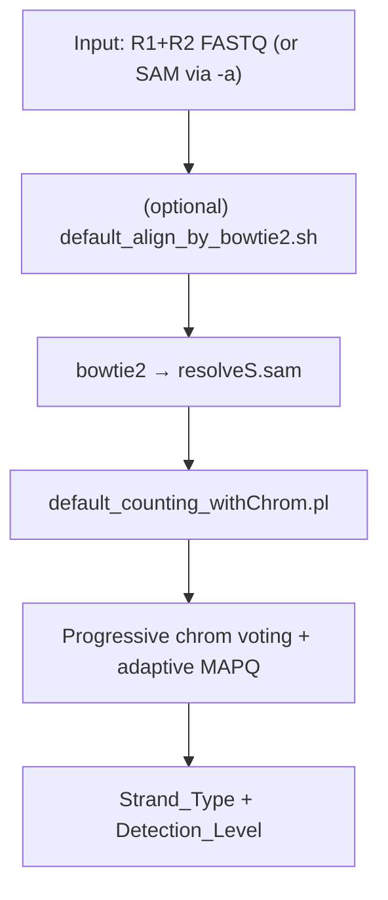
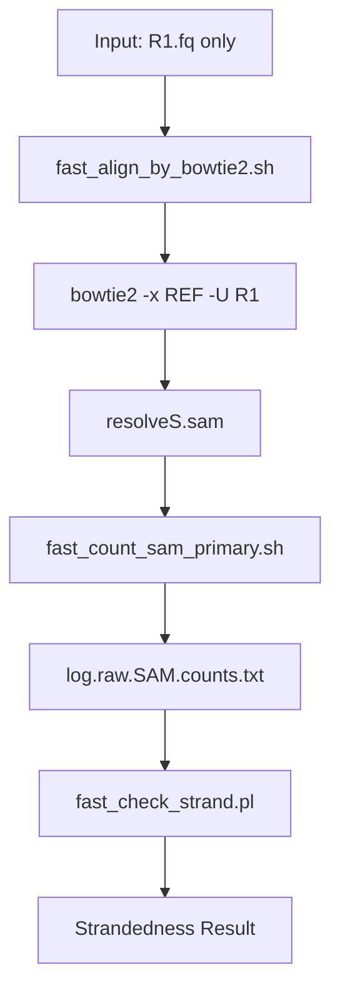
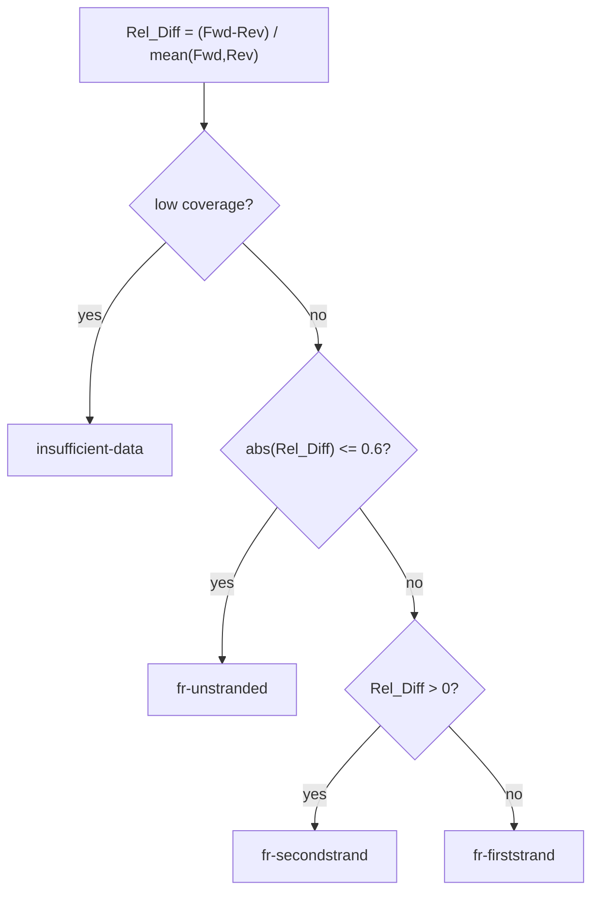

# resolveS: An ultra-fast, memory-efficient and reference-free tool for RNA-seq Strandedness Detection

[English](README.md) | [中文](README_zh.md)

The goal of this tool is "Rapid RNA-Seq Strand Specificity Detection".

Accurate determination of strand specificity (stranded vs. non-stranded) is a critical prerequisite for transcriptomic analysis. It is a necessary parameter for configuring essential bioinformatics tools like featureCounts and Trinity. However, this information is often missing or incorrectly annotated in public datasets, which can lead to reproducibility issues and misinterpretation of results.

resolveS is a high-performance tool designed to solve this problem instantly. It is **super-fast, memory-efficient**, and user-friendly, making it the perfect addition to any RNA-Seq Quality Control (QC) pipeline. Whether you are exploring public data or validating your own libraries, resolveS provides the necessary metadata to ensure your downstream analysis is accurate and reproducible.

In addition to being faster and more memory-efficient, resolveS introduces a new feature: it can infer strandedness for species without a reference genome and report a confidence level.

# Installation & Usage Guide

First, please download the archive file from the **releases** section. Follow the instructions below based on your existing environment to proceed with the software installation.

Please refer to `$ resolveS -h` for more information on the version and usage.

---

## 1. Out-of-the-Box: One-Stop Solution

If you prefer a `one-step solution`, don't want to install any dependencies, and want to run directly in any environment.

Then download `resolveS_singularity_v0.1.x.sif` or `resolveS_apptainer_v0.1.x.sif`. This is a ready-to-use and time-saving `solution`. No need to install anything!

If you want software that works out of the box without installing any complex dependencies:

```bash
# Paired-end (recommended)
singularity exec /path/to/resolveS_singularity_v0.1.x.sif resolveS -1 sample_R1.fq.gz -2 sample_R2.fq.gz

# Single-end (fast)
singularity exec /path/to/resolveS_singularity_v0.1.x.sif resolveS_fast -s sample_R1.fq.gz
```

## 2. Portable Program Version

If you don't want to learn about containers, want to use the software directly, and don't want to install any dependencies, you can use the portable version.

Then download `portable_program_v0.1.x.tar.gz`, and extract it with `tar -xvf ...`

You will get the following program structure after extraction:

```
resolveS
├── LICENSE
├── README.md
├── README_zh.md
├── bin
│   ├── resolveS                       # Default (paired-end FASTQ or pre-aligned SAM)
│   ├── resolveS_fast                  # Fast (single-end FASTQ)
│   ├── default_align_by_bowtie2.sh
│   ├── fast_align_by_bowtie2.sh
│   ├── fast_count_sam_primary.sh
│   ├── fast_check_strand.pl           # Strand bias analysis (Perl)
│   └── default_counting_withChrom.pl  # Progressive per-chrom detection (Perl)
├── bowtie2
├── examples
├── ref_default
```

Usage:

```bash
# Default version (paired-end)
./resolveS/bin/resolveS -1 sample_R1.fq.gz -2 sample_R2.fq.gz

# Fast version (single-end, for quick analysis)
./resolveS/bin/resolveS_fast -s sample_R1.fq.gz
#File	Strandedness	NeedPrecise	Fwd	Rev	Fwd_Ratio	Rev_Ratio	Rel_Diff	Chi2	P_value
#sample_R1.fq.gz	fr-unstranded	F	4142	3953	0.511674	0.488326	0.046695	4.412724	3.567184e-02
```

Save the results to a text file:

```bash
# Paired-end: use -o to write results
./resolveS/bin/resolveS -1 sample_R1.fq.gz -2 sample_R2.fq.gz -o results.tsv

# Single-end: redirect stdout
./resolveS/bin/resolveS_fast -s sample_R1.fq.gz > results.tsv
```

Finally, the `Strand_Type` (paired-end) / `Strandedness` (fast) column is the inferred result.

The `-b` parameter allows batch processing (FASTQ list for `resolveS_fast`, FASTQ/SAM list for `resolveS`).

## Script Variants

resolveS provides multiple script variants for different use cases:

| Script          | Description                                 | Input Mode        | Default `-u` | Core Scripts                                                                          |
| --------------- | ------------------------------------------- | ----------------- | ------------ | ------------------------------------------------------------------------------------- |
| `resolveS`      | Default (paired-end FASTQ or pre-aligned SAM) | `-1/-2` or `-a`   | 5M pairs     | `default_align_by_bowtie2.sh` + `default_counting_withChrom.pl`                       |
| `resolveS_fast` | Fast (single-end FASTQ)                     | `-s`              | 1M reads     | `fast_align_by_bowtie2.sh` + `fast_count_sam_primary.sh` + `fast_check_strand.pl`     |

## 3. If you already have **Bowtie 2** and **Perl** installed

Simply extract the downloaded archive. Then, you can directly run the executable file named `resolveS`. If you wish to execute it from any directory, you may add this file to your system's `PATH` environment variable.

> The release archive usually includes the default bowtie2 index at `ref_default/`. If not, download it from `https://github.com/yudalang3/resolveS/releases`.

The final program structure should be as follows:

```
resolveS/
├── bin/
│   ├── resolveS
│   ├── resolveS_fast
│   ├── default_align_by_bowtie2.sh
│   ├── fast_align_by_bowtie2.sh
│   ├── fast_count_sam_primary.sh
│   ├── fast_check_strand.pl
│   └── default_counting_withChrom.pl
└── ref_default/
    ├── default.1.bt2
    ├── default.2.bt2
    ├── default.3.bt2
    ├── default.4.bt2
    ├── default.rev.1.bt2
    └── default.rev.2.bt2

```

---

## 4. If you prefer using **Conda** / **Mamba**

You are already an advanced user. You can check the `bin` directory yourself and modify `BOWTIE2_BIN` variable in `default_align_by_bowtie2.sh` or `fast_align_by_bowtie2.sh` to configure `bowtie2`.

> You also need to download the bowtie2 index files


Then follow the general steps:

**Method 1: Create and Activate Environment (Recommended)**

```bash
conda/mamba create -n resolveS bowtie2 perl
conda/mamba activate resolveS
```

**Method 2: Create Environment, then Install via Bioconda**

```
conda/mamba create -n resolveS
conda/mamba activate resolveS
mamba install bioconda::bowtie2 perl
```

After activating the environment, proceed with the installation steps as described in the section above ("If you already have Bowtie 2 and Perl installed").


# Usage and Output Demonstration

For the end-user, the most convenient usage is:

- Paired-end (recommended): `resolveS -1 R1.fq.gz -2 R2.fq.gz`
- Single-end (fast): `resolveS_fast -s R1.fq.gz`

Note: `resolveS_fast` takes **one** FASTQ file (R1 only). `resolveS` expects **two** files (R1 + R2) unless you use `-a` to supply a pre-aligned SAM.

Output formats differ between the two scripts:

- `resolveS` outputs: `File`, `Strand_Type`, `MAPQ_Filter`, `Detection_Level`, `Overall_fallback_Fwd`, `Overall_fallback_Rev`, `Overall_fallback_Fwd_Ratio`, `Overall_fallback_Rev_Ratio`, `Overall_fallback_Rel_Diff`
- `resolveS_fast` outputs: `File`, `Strandedness`, `NeedPrecise`, `Fwd`, `Rev`, `Fwd_Ratio`, `Rev_Ratio`, `Rel_Diff`, `Chi2`, `P_value`

Notes for `resolveS` output columns:

- `File`: input identifier (absolute path of R1 or SAM)
- `MAPQ_Filter`: final MAPQ cutoff used (`MAPQ-20/10/3/0`)
- `Detection_Level`: progressive detection stage (e.g. `3of3`, `4of5`, `6of7`, `7of8`) or `*-fallback`
- `Overall_fallback_Fwd`/`Overall_fallback_Rev`: number of chromosomes where forward/reverse read counts dominate (ties excluded)
- `Overall_fallback_Fwd_Ratio`/`Overall_fallback_Rev_Ratio`: proportion of fwd/rev chromosomes (e.g. 0.538 means 53.8%)
- `Overall_fallback_Rel_Diff`: relative difference = (Fwd - Rev) / mean(Fwd, Rev); positive = forward-biased

## Interpreting Results

The `Detection_Level` column in `resolveS` output indicates the confidence of strand detection. Higher levels mean more agreement among top chromosomes.

### Confidence Level Table (from highest to lowest)

| MAPQ_Filter | Detection_Level | Confidence | Description |
|-------------|-----------------|------------|-------------|
| MAPQ-20 | 3of3 | Highest | Top 3 chromosomes all agree |
| MAPQ-20 | 4of5 | High | 4 of top 5 chromosomes agree |
| MAPQ-20 | 6of7 | High | 6 of top 7 chromosomes agree |
| MAPQ-20 | 7of8 | Moderate | 7 of top 8 chromosomes agree |
| MAPQ-10 | 3of3 ~ 7of8 | Moderate | Same as above but required lower MAPQ threshold |
| MAPQ-3 | 3of3 ~ 7of8 | Low | Required very low MAPQ threshold |
| MAPQ-0 | 3of3 ~ 7of8 | Low | No MAPQ filtering applied |
| Any | *-fallback | Lowest | Progressive detection failed; used global Rel_Diff as fallback |

**Key points:**

- `MAPQ-20` results are most reliable (high-quality alignments only)
- Lower MAPQ thresholds (10/3/0) are tried progressively only when higher thresholds yield `all-insufficient-fallback`
- `*-fallback` suffix indicates the progressive per-chromosome detection failed and the final result is based on global statistics
- Common fallback types: `only-N-chroms-fallback`, `4of8-split-fallback`, `multi-of8-fallback`, `all-insufficient-fallback`

## Technical Details

### Pipeline overview (Default: resolveS)

The default `resolveS` uses **paired-end alignment** (or a pre-aligned SAM) and performs **progressive per-chromosome detection**:



Key points:

- Uses **paired-end** alignment (`-1 R1.fq -2 R2.fq`) by default, or accepts a SAM file (`-a aligned.sam`)
- Progressive detection based on top chromosomes (3/3 → 4/5 → 6/7 → 7/8), with fallback when needed
- Adaptive MAPQ thresholds: 20 → 10 → 3 → 0 (only when necessary)
- Default: 5M read pairs (`-u 5`)

### Pipeline overview (Fast: resolveS_fast)

The `resolveS_fast` uses **single-end alignment** for quick analysis:



Key points:
- Uses **single-end** alignment (`-s R1.fq`)
- Counts all primary alignments (simple, fast)
- Default: 1M reads (`-u 1`)
- Faster but may be less accurate than paired-end mode

### Decision logic (current implementation)

#### MAPQ Progressive Strategy (resolveS only)

The `resolveS` script uses an adaptive MAPQ strategy to maximize detection success:


This ensures high-quality results when possible, but falls back to lower MAPQ thresholds when necessary.

#### Strand Type Determination



Core formulas in `bin/fast_check_strand.pl`:

- `Fwd_Ratio = Fwd / (Fwd + Rev)`
- `Rel_Diff = (Fwd - Rev) / ((Fwd + Rev) / 2)` (signed; positive = forward-biased)
- `Chi2 = (Fwd - E)^2/E + (Rev - E)^2/E`, where `E = (Fwd + Rev)/2`
- `P_value = erfc(sqrt(Chi2 / 2))`
- `NeedPrecise = T` when `total <= 80` or `0.2 < |Rel_Diff| < 0.8`

# Full Program Documentation

## Parameters Explanation

### resolveS (Paired-end FASTQ or pre-aligned SAM)

**Single sample mode:**
- `-1 <file>`: R1 (first read) fastq file.
- `-2 <file>`: R2 (second read) fastq file.
- `-a <file>`: Pre-aligned SAM file mode: skip alignment and use an existing SAM file.
- `-p <int>`: Number of threads (default: 8).
- `-u <number>`: Maximum number of read pairs to align, in millions (default: 5).
- `-r <path>`: Reference genome database path, can be any bowtie2 index (default: ../ref_default/default).
- `-o <file>`: Output the inference results to the file (default: stdout).
- `-d`: Debug mode - keep intermediate files and print per-chromosome summary to stderr.
- `-h`: Show help message and exit.

**Batch mode:**
- `-b <meta_data_file>`: Metadata file (auto-detected):
  - FASTQ batch: 2 columns (tab-separated `R1_path<TAB>R2_path`)
  - SAM batch: 1 column (`SAM_path` per line)

### resolveS_fast (Single-end mode)

**Single file mode:**
- `-s <file>`: Input fastq file (R1 only).
- `-p <int>`: Number of threads (default: 8).
- `-u <number>`: Maximum number of reads to align, in millions (default: 1).
- `-r <path>`: Reference genome database path, can be any bowtie2 index (default: ../ref_default/default).
- `-c <file>`: Set the intermediate count-matrix file name (default: log.raw.SAM.counts.txt).
- `-d`: Debug mode - keep intermediate files (resolveS.sam and the count matrix).
- `-h`: Show help message and exit.

**Batch mode:**
- `-b <meta_data_file>`: A metadata file with one fastq file path per line.

### Intermediate Files

When using `-d` (debug mode), the following intermediate files are preserved:
- `resolveS.sam`: The alignment output from bowtie2.
- `log.raw.SAM.counts.txt` (or custom via `-c`, for `resolveS_fast`): The counting results before strand analysis.
- **stderr output**: When `-d` is enabled, `default_counting_withChrom.pl` prints per-chromosome distribution tables to stderr, including chromosome name, forward/reverse counts, total, major strand direction, and strand type for each chromosome.

---

## What's New (v0.1.x)

- `resolveS` supports pre-aligned SAM input (`-a`) and auto-detecting batch metadata (FASTQ 2-column or SAM 1-column).
- Default pipeline is simplified to `align → default_counting_withChrom.pl` (progressive per-chromosome voting + adaptive MAPQ).
- `resolveS_fast` uses a Perl strand bias analyzer (`bin/fast_check_strand.pl`); Python dependency is removed.
- Output defaults to stdout; use `resolveS -o` to write results to a file.
- Cutoffs updated: `abs(Rel_Diff) <= 0.6` ⇒ `fr-unstranded`; low-coverage ⇒ `insufficient-data`.
