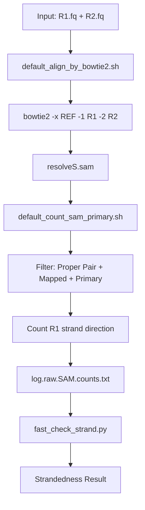
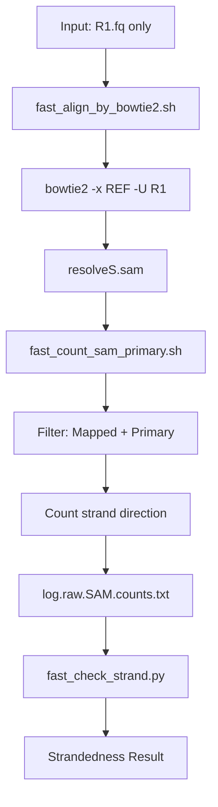
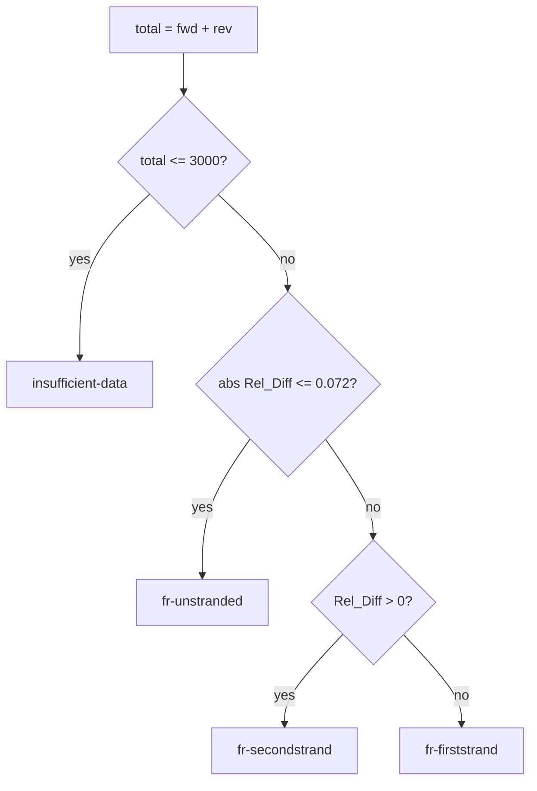

# resolveS: Rapid RNA-Seq Strand Specificity Detection

[English](README.md) | [中文](README_zh.md)

The goal of this tool is "Rapid RNA-Seq Strand Specificity Detection".


Accurate determination of strand specificity (stranded vs. non-stranded) is a critical prerequisite for transcriptomic analysis. It is a necessary parameter for configuring essential bioinformatics tools like featureCounts and Trinity. However, this information is often missing or incorrectly annotated in public datasets, which can lead to reproducibility issues and misinterpretation of results.

resolveS is a high-performance tool designed to solve this problem instantly. It is **super-fast, memory-efficient**, and user-friendly, making it the perfect addition to any RNA-Seq Quality Control (QC) pipeline. Whether you are exploring public data or validating your own libraries, resolveS provides the necessary metadata to ensure your downstream analysis is accurate and reproducible.

# Installation & Usage Guide

First, please download the archive file from the **releases** section. Follow the instructions below based on your existing environment to proceed with the software installation.

Please refer to `$ resolveS -h` for more information on the version and usage.

---

## 1. Out-of-the-Box: One-Stop Solution

If you prefer a `one-step solution`, don't want to install any dependencies, and want to run directly in any environment.

Then download `resolveS_singularity_v0.0.x.sif` or `resolveS_apptainer_v0.0.x.sif`. This is a ready-to-use and time-saving `solution`. No need to install anything!

If you want software that works out of the box without installing any complex dependencies:

```bash
# Run the default command within the container
singularity run /path/to/resolveS_singularity_v0.0.1.sif -s 1_fastq.gz
#### Or ####
# Execute the 'resolveS' command directly within the container
singularity exec resolveS_v0.0.1.sif resolveS
```


## 2. Portable Program Version

If you don't want to learn about containers, want to use the software directly, and don't want to install any dependencies, you can use the portable version.

Then download `portable_program_v0.0.x.tar.gz`, and extract it with `tar -xvf ...`

You will get the following program structure after extraction:

```
resolveS
├── LICENSE
├── README.md
├── README_zh.md
├── benchmark
│   ├── benchmark_test.sh
│   ├── input.batch.run.txt
│   └── results.tsv
├── bin
│   ├── resolveS                  # Default (paired-end)
│   ├── resolveS_fast             # Fast (single-end)
│   ├── resolveS_singlePrecise    # Precise (paired-end, 10M)
│   ├── default_align_by_bowtie2.sh
│   ├── default_count_sam_primary.sh
│   ├── fast_align_by_bowtie2.sh
│   ├── fast_count_sam_primary.sh
│   ├── fast_check_strand.py
│   ├── precise_count_sam_1M_increase.sh
│   └── precise_check_strand_step1M_withCount.py
├── bowtie2
```

Usage:

```bash
# Default version (paired-end)
./resolveS/bin/resolveS -1 ~/project/xxxx/0h_1A/0h_1A_R1.fq.gz -2 ~/project/xxxx/0h_1A/0h_1A_R2.fq.gz

# Fast version (single-end, for quick analysis)
./resolveS/bin/resolveS_fast -s ~/project/xxxx/0h_1A/0h_1A_1.fq.gz
#[INFO] Processing: /home/dell/project/xxx/0h_1A/0h_1A_1.fq.gz (threads: 6, max_alig_reads: 1000000, reference: /mnt/c/Users/yudal/Documents/resolveS/bin/../ref_default/default)
#ls ~/project/xxx 1000000 reads; of these:
#  1000000 (100.00%) were unpaired; of these:
#    991905 (99.19%) aligned 0 times
#    552 (0.06%) aligned exactly 1 time
#    7543 (0.75%) aligned >1 times
#0.81% overall alignment rate
#File    Strandedness    Fwd     Rev     Total   Fwd_Ratio       Rev_Ratio       F2R_Ratio       Log2_F2R        Rel_Diff        Chi2    P_value Cohens_h   Cramers_V       Bayes_Factor    Epsilon Hellinger       Entropy
#/home/dell/project/xxx/0h_1A/0h_1A_1.fq.gz    fr-unstranded   4142    3953    8095    0.511674        0.488326        1.047812        0.067371   0.046695        4.412724        3.567184e-02    0.023350        0.023348        7.905134e+00    0.016512        0.008255        0.999607
#[INFO] Cleaned up temporary file: resolveS.sam
#[INFO] Cleaned up temporary file: log.raw.SAM.counts.txt
#[INFO] All done!
```

Save the results to a text file:


```bash
./resolveS/bin/resolveS -s ~/project/xxxx/0h_1A/0h_1A_1.fq.gz > results.txt
cat results.txt
#File    Strandedness    Fwd     Rev     Total   Fwd_Ratio       Rev_Ratio       F2R_Ratio       Log2_F2R        Rel_Diff        Chi2    P_value Cohens_h   Cramers_V       Bayes_Factor    Epsilon Hellinger       Entropy
#/home/dell/project/xxx/0h_1A/0h_1A_1.fq.gz    fr-unstranded   4142    3953    8095    0.511674        0.488326        1.047812        0.067371   0.046695        4.412724        3.567184e-02    0.023350        0.023348        7.905134e+00    0.016512        0.008255        0.999607
```

Finally, the `Strandedness` column is the inferred result.

The `-b` parameter allows batch processing.

## Script Variants

resolveS provides multiple script variants for different use cases:

| Script | Description | Input Mode | Default -u | Counting Method |
|--------|-------------|------------|------------|------------------|
| `resolveS` | Default version using paired-end alignment | `-1 R1.fq -2 R2.fq` | 1M | default_count_sam_primary.sh (proper pair) |
| `resolveS_fast` | Fast version using single-end alignment | `-s R1.fq` | 1M | fast_count_sam_primary.sh |
| `resolveS_singlePrecise` | Precise mode with 1M incremental analysis | `-1 R1.fq -2 R2.fq` | 10M | precise_count_sam_1M_increase.sh |

### Script Dependencies

```
bin/
├── resolveS                              # Default (paired-end, 1M)
├── default_align_by_bowtie2.sh           # Paired-end alignment (shared)
├── default_count_sam_primary.sh          # Proper pair counting
│
├── resolveS_singlePrecise                # Precise (paired-end, 10M, 1M increments)
├── precise_count_sam_1M_increase.sh      # 1M incremental counting
├── precise_check_strand_step1M_withCount.py  # Incremental analysis
│
├── resolveS_fast                         # Fast (single-end, 1M)
├── fast_align_by_bowtie2.sh              # Single-end alignment
├── fast_count_sam_primary.sh             # Primary alignment counting
├── fast_check_strand.py                  # Strand analysis (shared)
│
└── oldbin/                               # Legacy versions
```

**Shared components:**
- `resolveS` and `resolveS_singlePrecise` share `default_align_by_bowtie2.sh`
- `precise_check_strand_step1M_withCount.py` imports functions from `fast_check_strand.py`

## 3. If you already have **Bowtie 2** and **Python 3** installed

Simply extract the downloaded archive. Then, you can directly run the executable file named `resolveS`. If you wish to execute it from any directory, you may add this file to your system's `PATH` environment variable.

> You also need to download the bowtie2 index files at `https://github.com/yudalang3/resolveS/releases`.

The final program structure should be as follows:

```
resolveS/
├── align_by_bowtie2.sh
├── check_strand.py
├── count_sam_primary.sh
├── count_sam_primary_unique.sh
├── ref_bowtie2
│   ├── default.1.bt2
│   ├── default.2.bt2
│   ├── default.3.bt2
│   ├── default.4.bt2
│   ├── default.rev.1.bt2
│   └── default.rev.2.bt2
└── resolveS

```

---

## 4. If you prefer using **Conda** / **Mamba**

You are already an advanced user. You can check the `bin` directory yourself and modify `align_by_bowtie2.sh` to configure `bowtie2`.

> You also need to download the bowtie2 index files


Then follow the general steps:

**Method 1: Create and Activate Environment (Recommended)**

```bash
conda/mamba create -n estimate python=3 bowtie2
conda/mamba activate estimate
```

**Method 2: Create Environment, then Install Bowtie 2 via Bioconda**

```
conda/mamba create -n estimate python=3
conda/mamba activate estimate
mamba install bioconda::bowtie2
```

After activating the environment, proceed with the installation steps as described in the section above ("If you already have Bowtie 2 and Python 3 installed").


# Usage and Output Demonstration

Take the `one-step solution` as an example:

> The `Strandedness` field(column) has four possible values: fr-unstranded, fr-firststrand, fr-secondstrand, and insufficient-data.

## Strandedness Determination Criteria

The tool uses a three-tier decision process to determine strand specificity:

1. **Total Count Check (Total > 3000)**
   - If the total count (Forward + Reverse) ≤ 3000, the result will be `insufficient-data`
   - This ensures sufficient statistical power for reliable inference

2. **Strand Specificity Test (Relative Difference > 1)**
   - If Relative Difference (Rel_Diff) ≤ 1, the result will be `fr-unstranded`
   - This indicates non-strand-specific sequencing

3. **Strand Orientation (F2R_Ratio > 1)**
   - If F2R_Ratio > 1, the result will be `fr-firststrand`
   - Otherwise, the result will be `fr-secondstrand`

These criteria ensure accurate and reliable strand specificity detection by filtering out low-coverage samples and properly distinguishing between different library preparation protocols.

```bash
$ time apptainer run /home/dell/projects/estimate_strand4NGS/formal_program/resolveS/db/resolveS_singularity_v0.0.1.sif -s ss/1-1/1-1_1.fq.gz -p 10 > results.tsv
[INFO] Processing: ss/1-1/1-1_1.fq.gz (threads: 10)
4000000 reads; of these:
  4000000 (100.00%) were unpaired; of these:
    3959187 (98.98%) aligned 0 times
    2686 (0.07%) aligned exactly 1 time
    38127 (0.95%) aligned >1 times
1.02% overall alignment rate
[INFO] Cleaned up temporary file: resolveS.sam
[INFO] Cleaned up temporary file: log.raw.SAM.counts.txt
[INFO] All done!
apptainer run  -s ss/1-1/1-1_1.fq.gz -p 10 > results.tsv  82.14s user 1.27s system 803% cpu 10.388 total
(base)
# dell @ dell-Precision-3660 in /home/dell/projects/estimate_strand4NGS/test_data1 [12:28:15]
$ cat results.tsv
File    Strandedness    Fwd     Rev     Total   Fwd_Ratio       Rev_Ratio       F2R_Ratio       Log2_F2R        Rel_Diff        Chi2    P_value Cohens_h        Cramers_V       Bayes_Factor        Epsilon Hellinger       Entropy
/home/dell/projects/estimate_strand4NGS/test_data1/ss/1-1/1-1_1.fq.gz   fr-secondstrand   3117    37696   40813   0.076373        0.923627        0.082688        -3.595969       1.694509    29297.215128    0.000000e+00    -1.010795       0.847255        0.000000e+00    0.748243        0.353579        0.389267

```

For the end-user, the `one-step solution` is the most convenient way to use resolveS.
You can focus on the `File` and `Strandedness` columns in the output TSV file.

## Technical Details

### Pipeline overview (Default: resolveS)

The default `resolveS` uses **paired-end alignment** for more accurate strand detection:



Key points:
- Uses **paired-end** alignment (`-1 R1.fq -2 R2.fq`)
- Only counts R1 reads from **proper pairs** to represent fragments
- Filters: Mapped (not 0x4) + Primary (not 0x100, 0x800) + Proper Pair (0x2) + First in pair (0x40)
- Default: 1M read pairs (`-u 1`)

### Pipeline overview (Fast: resolveS_fast)

The `resolveS_fast` uses **single-end alignment** for quick analysis:



Key points:
- Uses **single-end** alignment (`-s R1.fq`)
- Counts all primary alignments
- Filters: Mapped (not 0x4) + Primary (not 0x100, 0x800)
- Default: 1M reads (`-u 1`)
- Faster but may be less accurate than paired-end mode

### Decision logic (current script implementation)



Core formulas in `bin/fast_check_strand.py`:

- `Fwd_Ratio = Fwd / (Fwd + Rev)`
- `Rel_Diff = (Fwd - Rev) / ((Fwd + Rev) / 2)` (signed; positive = forward-biased)
- `Chi2 = (Fwd - E)^2/E + (Rev - E)^2/E`, where `E = (Fwd + Rev)/2`
- `P_value = erfc(sqrt(Chi2 / 2))`
- `NeedPrecise = T` when `total <= 3000` or `0.07156908 < |Rel_Diff| < 2/3`

# Full Program Documentation

## Parameters Explanation

### resolveS / resolveS_singlePrecise (Paired-end mode)

**Single sample mode:**
- `-1 <file>`: R1 (first read) fastq file.
- `-2 <file>`: R2 (second read) fastq file.
- `-p <int>`: Number of threads (default: 6).
- `-u <number>`: Maximum number of read pairs to align, in millions (default: 1 for resolveS, 10 for resolveS_singlePrecise).
- `-r <path>`: Reference genome database path, can be any bowtie2 index (default: ../ref_default/default).
- `-d`: Debug mode - keep intermediate files (resolveS.sam, counts.txt).
- `-c <file>`: Output the count matrix from the SAM file (default: log.raw.SAM.counts.txt) debug option.
- `-h`: Show help message and exit.

**Batch mode:**
- `-b <meta_data_file>`: A metadata file with tab-separated R1 and R2 paths per line.

### resolveS_fast (Single-end mode)

**Single file mode:**
- `-s <file>`: Input fastq file (R1 only).
- `-p <int>`: Number of threads (default: 6).
- `-u <number>`: Maximum number of reads to align, in millions (default: 1).
- `-r <path>`: Reference genome database path, can be any bowtie2 index (default: ../ref_default/default).
- `-d`: Debug mode - keep intermediate files (resolveS.sam, counts.txt).
- `-c <file>`: Output the count matrix from the SAM file (default: log.raw.SAM.counts.txt) debug option.
- `-h`: Show help message and exit.

**Batch mode:**
- `-b <meta_data_file>`: A metadata file with one fastq file path per line.

### Intermediate Files

When using `-d` (debug mode), the following intermediate files are preserved:
- `resolveS.sam`: The alignment output from bowtie2.
- `log.raw.SAM.counts.txt` (or custom via `-c`): The counting results before strand analysis.
