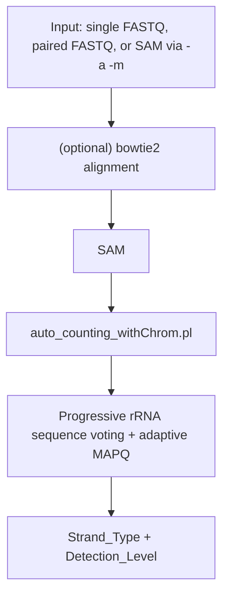
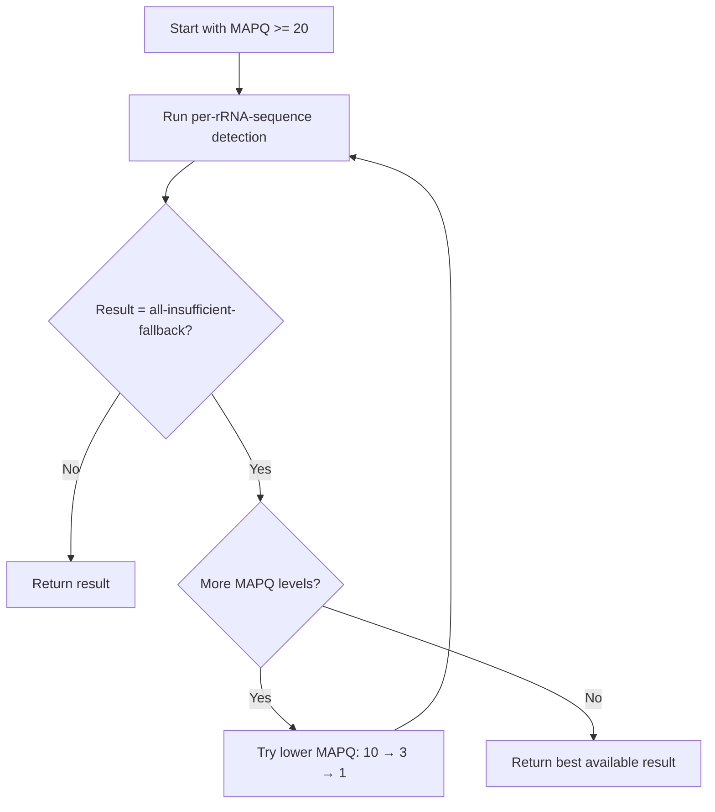
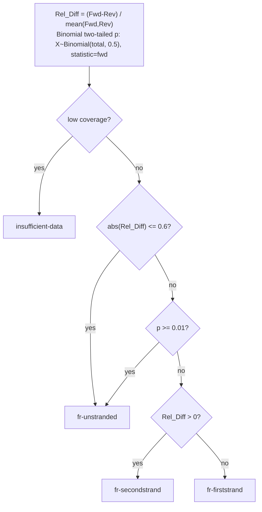

# resolveS: An ultra-fast, memory-efficient and reference-free tool for RNA-seq Strandedness Detection

[English](README.md) | [中文](README_zh.md)

The goal of this tool is "Rapid RNA-Seq Strand Specificity Detection".

Accurate determination of strand specificity (stranded vs. non-stranded) is a critical prerequisite for transcriptomic analysis. It is a necessary parameter for configuring essential bioinformatics tools like featureCounts and Trinity. However, this information is often missing or incorrectly annotated in public datasets, which can lead to reproducibility issues and misinterpretation of results.

resolveS is a high-performance tool designed to solve this problem instantly. It is **super-fast, memory-efficient**, and user-friendly, making it the perfect addition to any RNA-Seq Quality Control (QC) pipeline. Whether you are exploring public data or validating your own libraries, resolveS provides the necessary metadata to ensure your downstream analysis is accurate and reproducible.

In addition to being faster and more memory-efficient, resolveS introduces a new feature: it can infer strandedness for species without a reference genome and report a confidence level.

# Installation & Usage Guide

First, please download the archive file from the **releases** section. Follow the instructions below based on your existing environment to proceed with the software installation.

Please refer to `$ resolveS -h` for more information on the version and usage.

---

## 1. Out-of-the-Box: One-Stop Solution

If you prefer a `one-step solution`, don't want to install any dependencies, and want to run directly in any environment.

Then download `resolveS_singularity_v0.2.x.sif` or `resolveS_apptainer_v0.2.x.sif`. This is a ready-to-use and time-saving `solution`. No need to install anything!

If you want software that works out of the box without installing any complex dependencies:

```bash
# Single-end FASTQ
singularity exec /path/to/resolveS_singularity_v0.2.x.sif resolveS -1 sample.fastq.gz

# Paired-end FASTQ
singularity exec /path/to/resolveS_singularity_v0.2.x.sif resolveS -1 sample_R1.fq.gz -2 sample_R2.fq.gz

# Pre-aligned single-end SAM
singularity exec /path/to/resolveS_singularity_v0.2.x.sif resolveS -a aligned.sam -m 1
```

## 2. Portable Program Version

If you don't want to learn about containers, want to use the software directly, and don't want to install any dependencies, you can use the portable version.

Then download `portable_program_v0.2.x.tar.gz`, and extract it with `tar -xvf ...`

You will get the following program structure after extraction:

```
resolveS
├── LICENSE
├── README.md
├── README_zh.md
├── bin
│   ├── resolveS                       # Single-end/paired-end FASTQ or explicit-mode SAM
│   ├── default_align_by_bowtie2.sh
│   ├── default_align_single_by_bowtie2.sh
│   ├── auto_counting_withChrom.pl     # Mode-aware single/pair counting
│   └── default_counting_withChrom.pl  # Progressive per-rRNA-sequence detection (Perl)
├── bowtie2
├── examples
├── ref_default
```

Usage:

```bash
# Single-end FASTQ
./resolveS/bin/resolveS -1 sample.fastq.gz

# Paired-end FASTQ
./resolveS/bin/resolveS -1 sample_R1.fq.gz -2 sample_R2.fq.gz

```

Save the results to a text file:

```bash
# Use -o to write results
./resolveS/bin/resolveS -1 sample_R1.fq.gz -2 sample_R2.fq.gz -o results.tsv

```

Finally, the `Strand_Type` column is the inferred result.

The `-b` parameter allows batch processing with FASTQ or SAM metadata.

## Script Variants

resolveS provides multiple script variants for different use cases:

| Script          | Description                                 | Input Mode        | Default `-u` | Core Scripts                                                                          |
| --------------- | ------------------------------------------- | ----------------- | ------------ | ------------------------------------------------------------------------------------- |
| `resolveS` | Single-end/paired-end FASTQ or explicit-mode SAM | `-1`, `-1/-2`, or `-a ... -m` | 5M reads or pairs | `default_align*_by_bowtie2.sh` + `auto_counting_withChrom.pl` |

## 3. If you already have **Bowtie 2** and **Perl** installed

Simply extract the downloaded archive. Then, you can directly run the executable file named `resolveS`. If you wish to execute it from any directory, you may add this file to your system's `PATH` environment variable.

> The release archive usually includes the default bowtie2 index at `ref_default/`. If not, download it from `https://github.com/yudalang3/resolveS/releases`.

The final program structure should be as follows:

```
resolveS/
├── bin/
│   ├── resolveS
│   ├── default_align_by_bowtie2.sh
│   ├── default_align_single_by_bowtie2.sh
│   ├── auto_counting_withChrom.pl
│   └── default_counting_withChrom.pl
└── ref_default/
    ├── default.1.bt2
    ├── default.2.bt2
    ├── default.3.bt2
    ├── default.4.bt2
    ├── default.rev.1.bt2
    └── default.rev.2.bt2

```

---

## 4. If you prefer using **Conda** / **Mamba**

You are already an advanced user. You can check the `bin` directory yourself and modify the `BOWTIE2_BIN` variable in `default_align_by_bowtie2.sh` to configure `bowtie2`.

> You also need to download the bowtie2 index files


Then follow the general steps:

**Method 1: Create and Activate Environment (Recommended)**

```bash
conda/mamba create -n resolveS bowtie2 perl
conda/mamba activate resolveS
```

**Method 2: Create Environment, then Install via Bioconda**

```
conda/mamba create -n resolveS
conda/mamba activate resolveS
mamba install bioconda::bowtie2 perl
```

After activating the environment, proceed with the installation steps as described in the section above ("If you already have Bowtie 2 and Perl installed").


# Usage and Output Demonstration

For the end-user, the most convenient usage is:

- Single-end FASTQ: `resolveS -1 sample.fastq.gz`
- Paired-end FASTQ: `resolveS -1 R1.fq.gz -2 R2.fq.gz`
- Single-end SAM: `resolveS -a aligned.sam -m 1`
- Paired-end SAM: `resolveS -a aligned.sam -m 2`

FASTQ mode is inferred automatically from `-1`/`-2`. SAM mode is never inferred: `-m 1` means single-end SAM and `-m 2` means paired-end SAM. `-p` and `-u` are ignored for SAM input and emit warnings when supplied.

`resolveS` outputs: `File`, `Strand_Type`, `MAPQ_Filter`, `Detection_Level`, `Overall_fallback_Fwd`, `Overall_fallback_Rev`, `Overall_fallback_Fwd_Ratio`, `Overall_fallback_Rev_Ratio`, `Overall_fallback_Rel_Diff`

Notes for `resolveS` output columns:

- `File`: input identifier (absolute path of R1 or SAM)
- `MAPQ_Filter`: final MAPQ cutoff used (`MAPQ-20/10/3/1`)
- `Detection_Level`: progressive detection stage (e.g. `3of3`, `4of5`, `6of7`, `7of8`) or `*-fallback`
- `Overall_fallback_Fwd`/`Overall_fallback_Rev`: number of rRNA sequences where forward/reverse read counts dominate (ties excluded)
- `Overall_fallback_Fwd_Ratio`/`Overall_fallback_Rev_Ratio`: proportion of fwd/rev rRNA sequences (e.g. 0.538 means 53.8%)
- `Overall_fallback_Rel_Diff`: relative difference = (Fwd - Rev) / mean(Fwd, Rev); positive = forward-biased

## Interpreting Results

The `Detection_Level` column in `resolveS` output indicates the confidence of strand detection. Higher levels mean more agreement among top rRNA sequences.

### Confidence Level Table (from highest to lowest)

| MAPQ_Filter | Detection_Level | Confidence | Description |
|-------------|-----------------|------------|-------------|
| MAPQ-20 | 3of3 | Highest | Top 3 rRNA sequences all agree |
| MAPQ-20 | 4of5 | High | 4 of top 5 rRNA sequences agree |
| MAPQ-20 | 6of7 | High | 6 of top 7 rRNA sequences agree |
| MAPQ-20 | 7of8 | Moderate | 7 of top 8 rRNA sequences agree |
| MAPQ-10 | 3of3 ~ 7of8 | Moderate | Same as above but required lower MAPQ threshold |
| MAPQ-3 | 3of3 ~ 7of8 | Low | Required very low MAPQ threshold |
| MAPQ-1 | 3of3 ~ 7of8 | Low | Most permissive threshold (still excludes MAPQ=0 multi-mappers) |
| Any | *-fallback | Lowest | Progressive detection failed; used global Rel_Diff as fallback |

**Key points:**

- `MAPQ-20` results are most reliable (high-quality alignments only)
- Lower MAPQ thresholds (10/3/1) are tried progressively only when higher thresholds yield `all-insufficient-fallback`
- `*-fallback` suffix indicates the progressive per-rRNA-sequence detection failed and the final result is based on global statistics
- Common fallback types: `only-N-rRNAs-fallback`, `4of8-split-fallback`, `multi-of8-fallback`, `all-insufficient-fallback`

## Technical Details

### Pipeline overview (Default: resolveS)

The default `resolveS` uses **single-end or paired-end alignment** (or an explicitly typed pre-aligned SAM) and performs **progressive per-rRNA-sequence detection**:



Key points:

- Uses **single-end** alignment (`-1 sample.fq`) or **paired-end** alignment (`-1 R1.fq -2 R2.fq`)
- Accepts a pre-aligned SAM file only with explicit mode (`-a aligned.sam -m 1` or `-a aligned.sam -m 2`)
- Progressive detection based on top rRNA sequences (3/3 → 4/5 → 6/7 → 7/8), with fallback when needed
- Adaptive MAPQ thresholds: 20 → 10 → 3 → 1 (only when necessary)
- Default: 5M reads for single-end FASTQ or 5M read pairs for paired-end FASTQ (`-u 5`)

### Decision logic (current implementation)

#### MAPQ Progressive Strategy (resolveS only)

The `resolveS` script uses an adaptive MAPQ strategy to maximize detection success:



This ensures high-quality results when possible, but falls back to lower MAPQ thresholds when necessary. The lowest tier is `MAPQ >= 1` (not 0), so MAPQ=0 pure multi-mappers are excluded even in the most permissive fallback.

#### Multi-mapping reads

rRNA sequences are highly repetitive, so a single read can align equally well to multiple reference copies. resolveS handles such multi-mapping reads as follows:

- **Bowtie2 runs in default mode** (no `-k`/`-a`), so each read produces **exactly one** best alignment — multiple alignments per read are never reported (no secondary `0x100` records).
- For a multi-mapping read, Bowtie2 places it pseudo-randomly at one location and assigns a **low MAPQ (0/1)**.
- Counting therefore **filters by MAPQ** (`>= 20` by default; see ladder above). This removes the pseudo-randomly placed multi-mappers, so the strand-bias signal is contributed only by uniquely mapped reads.
- In the paired-end pipeline, only **R1** is counted and a **proper pair** (`0x2`) is required; filtering R1 by MAPQ effectively discards the whole multi-mapping pair.

#### Strand Type Determination



# Full Program Documentation

## Parameters Explanation

### resolveS (single-end/paired-end FASTQ or pre-aligned SAM)

**Single sample mode:**
- `-1 <file>`: FASTQ file. With only `-1`, runs single-end FASTQ mode; with `-1` and `-2`, runs paired-end FASTQ mode.
- `-2 <file>`: R2 fastq file for paired-end FASTQ mode.
- `-a <file>`: Pre-aligned SAM file mode: skip alignment and use an existing SAM file.
- `-m <1|2>`: SAM input only. `1` = single-end SAM, `2` = paired-end SAM. Required with `-a` or SAM batch; invalid for FASTQ input.
- `-p <int>`: Number of alignment threads (default: 8). Ignored for SAM input.
- `-u <number>`: FASTQ alignment limit, in millions (default: 5). In single-end mode this means reads; in paired-end mode this means read pairs. Ignored for SAM input.
- `-r <path>`: Reference genome database path, can be any bowtie2 index (default: ../ref_default/default).
- `-o <file>`: Output the inference results to the file (default: stdout).
- `-d`: Debug mode - keep intermediate files and print per-rRNA-sequence summary to stderr.
- `-h`: Show help message and exit.

**Batch mode:**
- `-b <meta_data_file>`: Metadata file (auto-detected):
  - Single-end FASTQ batch: 1 FASTQ path per line
  - Paired-end FASTQ batch: 2 columns (tab-separated `R1_path<TAB>R2_path`)
  - SAM batch: 1 SAM path per line and requires `-m 1` or `-m 2`

### Intermediate Files

When using `-d` (debug mode), the following intermediate files are preserved:
- `resolveS.sam`: The alignment output from bowtie2 for non-batch FASTQ runs.
- `resolveS.sample_0001.sam`, `resolveS.sample_0002.sam`, ...: Per-sample alignment output for FASTQ batch runs.
- **stderr output**: When `-d` is enabled, `auto_counting_withChrom.pl` prints per-rRNA-sequence distribution tables to stderr, including rRNA sequence name, forward/reverse counts, total, major strand direction, and strand type for each rRNA sequence.

---

## What's New (v0.2.0)

- `resolveS` supports single-end FASTQ input (`-1 sample.fastq.gz`) and keeps paired-end FASTQ input (`-1 R1 -2 R2`).
- Pre-aligned SAM input now requires explicit mode: `-m 1` for single-end SAM and `-m 2` for paired-end SAM.
- Batch metadata supports homogeneous single-end FASTQ, paired-end FASTQ, or SAM batches.
- Default pipeline is `align → auto_counting_withChrom.pl` (mode-aware progressive per-rRNA-sequence voting + adaptive MAPQ).
- Output defaults to stdout; use `resolveS -o` to write results to a file.
- Strand calls now require both `abs(Rel_Diff) > 0.6` and binomial two-tailed `p < 0.01`; otherwise the rRNA sequence is treated as `fr-unstranded`.
