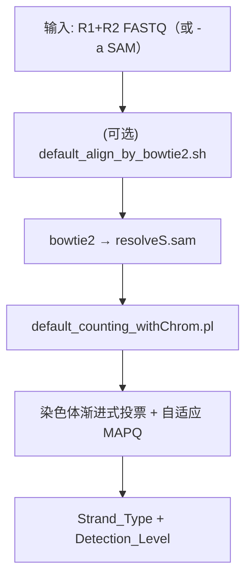
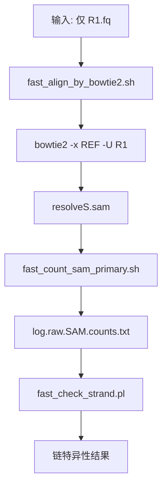
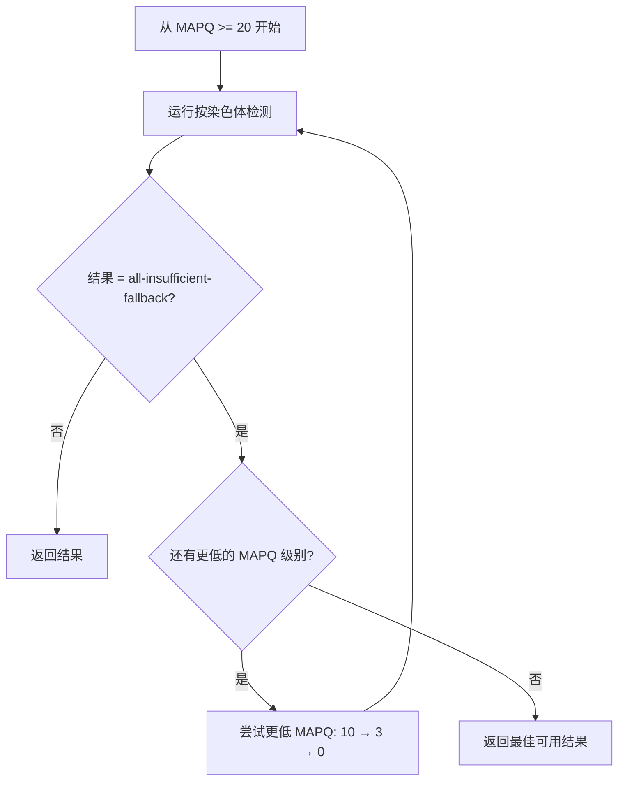
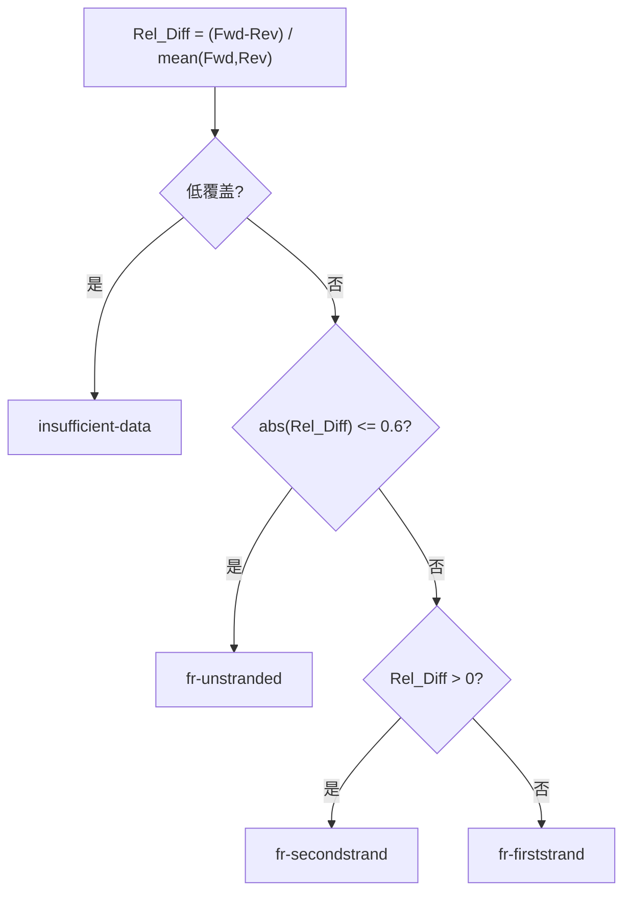

# resolveS: 快速检测 RNA-Seq 链特异性

[English](README.md) | [中文](README_zh.md)

本工具的目标是"快速检测 RNA-Seq 链特异性"。

准确判定链特异性（有链特异性 vs. 无链特异性）是转录组分析的关键前提。它是配置 featureCounts 和 Trinity 等重要生物信息学工具的必要参数。然而，这一信息在公共数据集中往往缺失或标注错误，可能导致结果重现性问题和错误解读。

resolveS 是一款旨在即时解决这一问题的高性能工具。它**超快速、低内存占用**且用户友好，是任何 RNA-Seq 质量控制（QC）流程的完美补充。无论您是探索公共数据还是验证自己的文库，resolveS 都能提供必要的元数据，确保下游分析的准确性和可重复性。

本软件除了运行更快、更省内存之外，实现了新功能：可以对没有参考基因组的物种进也进行链特异性方式的判定并且给出置信程度。

# 安装说明 & 使用指导

首先，请从 **releases** 部分下载压缩包文件。根据您现有的环境，按照以下说明进行软件安装。

请参阅 $ resolveS -h 以获取有关版本和用法的更多信息。

---

## 1. 开箱即用：一站式服务

如果您偏好 `一步到位的解决方案`，不想安装任何依赖，任何环境都想直接能运行。

那么就下载 `resolveS_singularity_v0.1.x.sif` 或者 `resolveS_apptainer_v0.1.x.sif`。这是一套即用型且省时的 `解决方案`。无需安装任何东西！

如果您希望获得开箱即用的软件，不想安装任何复杂的依赖：

```bash
# 双端（推荐）
singularity exec /path/to/resolveS_singularity_v0.1.x.sif resolveS -1 sample_R1.fq.gz -2 sample_R2.fq.gz

# 单端（快速）
singularity exec /path/to/resolveS_singularity_v0.1.x.sif resolveS_fast -s sample_R1.fq.gz
```

## 2. 绿色免安装版本 portable_program

如果您不想了解容器的使用，想直接使用软件，且不想安装任何依赖，可以使用免安装版本。

那么就下载 `portable_program_v0.1.x.tar.gz`，然后解压 `tar -xvf ...`

得到以下的程序，解压之后的内容如下：

```
resolveS
├── LICENSE
├── README.md
├── README_zh.md
├── bin
│   ├── resolveS                       # 默认版本（双端 FASTQ 或已比对 SAM）
│   ├── resolveS_fast                  # 快速版本（单端 FASTQ）
│   ├── default_align_by_bowtie2.sh
│   ├── fast_align_by_bowtie2.sh
│   ├── fast_count_sam_primary.sh
│   ├── fast_check_strand.pl           # 链偏好分析（Perl）
│   └── default_counting_withChrom.pl  # 染色体渐进式检测（Perl）
├── bowtie2
├── examples
├── ref_default
```

使用方法：

```bash
# 默认版本（双端比对）
./resolveS/bin/resolveS -1 sample_R1.fq.gz -2 sample_R2.fq.gz

# 快速版本（单端比对，用于快速分析）
./resolveS/bin/resolveS_fast -s sample_R1.fq.gz
#File	Strandedness	NeedPrecise	Fwd	Rev	Fwd_Ratio	Rev_Ratio	Rel_Diff	Chi2	P_value
#sample_R1.fq.gz	fr-unstranded	F	4142	3953	0.511674	0.488326	0.046695	4.412724	3.567184e-02
```

将结果保存到文本文件中：

```bash
# 双端：使用 -o 直接写入
./resolveS/bin/resolveS -1 sample_R1.fq.gz -2 sample_R2.fq.gz -o results.tsv

# 单端：重定向 stdout
./resolveS/bin/resolveS_fast -s sample_R1.fq.gz > results.tsv
```

最终，`Strand_Type`（双端）/ `Strandedness`（快速版）列就是推断的结果。

-b 参数可以批量运行。

## 脚本变体

resolveS 提供多个脚本变体以适应不同的使用场景：

| 脚本              | 描述                                | 输入模式            | 默认 `-u` | 关键脚本                                                                                |
| ----------------- | ----------------------------------- | ------------------- | ----------- | --------------------------------------------------------------------------------------- |
| `resolveS`      | 默认版本（双端 FASTQ 或已比对 SAM） | `-1/-2` 或 `-a` | 5M pairs    | `default_align_by_bowtie2.sh` + `default_counting_withChrom.pl`                     |
| `resolveS_fast` | 快速版本（单端 FASTQ）              | `-s`              | 1M reads    | `fast_align_by_bowtie2.sh` + `fast_count_sam_primary.sh` + `fast_check_strand.pl` |

## 3. 如果您已安装 **Bowtie 2** 和 **Perl**

只需解压下载的压缩包。然后，您可以直接运行名为 `resolveS` 的可执行文件。如果希望从任何目录执行它，可以将此文件添加到系统的 `PATH` 环境变量中。

> release 压缩包通常包含 `ref_default/` 默认索引；如果没有，请从 `https://github.com/yudalang3/resolveS/releases` 下载。

最终的程序结构应如下所示：

```
resolveS/
├── bin/
│   ├── resolveS
│   ├── resolveS_fast
│   ├── default_align_by_bowtie2.sh
│   ├── fast_align_by_bowtie2.sh
│   ├── fast_count_sam_primary.sh
│   ├── fast_check_strand.pl
│   └── default_counting_withChrom.pl
└── ref_default/
    ├── default.1.bt2
    ├── default.2.bt2
    ├── default.3.bt2
    ├── default.4.bt2
    ├── default.rev.1.bt2
    └── default.rev.2.bt2
```

---

## 4. 如果您偏好使用 **Conda** / **Mamba**

您已经是高级用户了，您可以自行查看 `bin` 目录，修改 `default_align_by_bowtie2.sh` 或 `fast_align_by_bowtie2.sh` 中的 `BOWTIE2_BIN` 变量来配置 `bowtie2`。

> 您还需要下载 bowtie2 索引文件

然后是一般的步骤：

**方法 1：创建并激活环境（推荐）**

```bash
conda/mamba create -n resolveS bowtie2 perl
conda/mamba activate resolveS
```

**方法 2：创建环境，然后通过 Bioconda 安装**

```
conda/mamba create -n resolveS
conda/mamba activate resolveS
mamba install bioconda::bowtie2 perl
```

激活环境后，按照上述部分（"如果您已安装 Bowtie 2 和 Perl"）中描述的安装步骤进行操作.

# 使用方法和输出演示

对于最终用户来说，最方便的用法是：

- 双端（推荐）：`resolveS -1 R1.fq.gz -2 R2.fq.gz`
- 单端（快速）：`resolveS_fast -s R1.fq.gz`

注意：`resolveS_fast` 只需要 **一个** FASTQ 文件（R1）；`resolveS` 需要 **两个** 文件（R1 + R2），除非使用 `-a` 直接输入已比对 SAM。

两个脚本输出格式不同：

- `resolveS` 输出：`File`、`Strand_Type`、`MAPQ_Filter`、`Detection_Level`、`Overall_fallback_Fwd`、`Overall_fallback_Rev`、`Overall_fallback_Fwd_Ratio`、`Overall_fallback_Rev_Ratio`、`Overall_fallback_Rel_Diff`
- `resolveS_fast` 输出：`File`、`Strandedness`、`NeedPrecise`、`Fwd`、`Rev`、`Fwd_Ratio`、`Rev_Ratio`、`Rel_Diff`、`Chi2`、`P_value`

`resolveS` 输出列说明：

- `File`：输入标识（R1 或 SAM 的绝对路径）
- `MAPQ_Filter`：最终采用的 MAPQ 阈值（`MAPQ-20/10/3/0`）
- `Detection_Level`：渐进式检测阶段（如 `3of3`、`4of5`、`6of7`、`7of8`）或 `*-fallback`
- `Overall_fallback_Fwd`/`Overall_fallback_Rev`：按染色体统计的"正向占优/反向占优"的染色体数量（剔除 tie）
- `Overall_fallback_Fwd_Ratio`/`Overall_fallback_Rev_Ratio`：正向/反向染色体的比例（如 0.538 表示 53.8%）
- `Overall_fallback_Rel_Diff`：相对差异 = (Fwd - Rev) / mean(Fwd, Rev)；正值表示正链占优

## 结果解读

`resolveS` 输出中的 `Detection_Level` 列表示链检测的置信度。级别越高，表示 top 染色体之间的一致性越好。

### 置信度等级表（从高到低）

| MAPQ_Filter | Detection_Level | 置信度 | 说明 |
|-------------|-----------------|--------|------|
| MAPQ-20 | 3of3 | 最高 | Top 3 染色体全部一致 |
| MAPQ-20 | 4of5 | 高 | Top 5 染色体中 4 个一致 |
| MAPQ-20 | 6of7 | 高 | Top 7 染色体中 6 个一致 |
| MAPQ-20 | 7of8 | 中等 | Top 8 染色体中 7 个一致 |
| MAPQ-10 | 3of3 ~ 7of8 | 中等 | 同上，但需要降低 MAPQ 阈值 |
| MAPQ-3 | 3of3 ~ 7of8 | 低 | 需要非常低的 MAPQ 阈值 |
| MAPQ-0 | 3of3 ~ 7of8 | 低 | 不进行 MAPQ 过滤 |
| 任意 | *-fallback | 最低 | 渐进式检测失败；使用全局 Rel_Diff 作为后备 |

**要点：**

- `MAPQ-20` 的结果最可靠（仅使用高质量比对）
- 只有当较高阈值产生 `all-insufficient-fallback` 时，才会逐步尝试较低的 MAPQ 阈值（10/3/0）
- `*-fallback` 后缀表示按染色体的渐进式检测失败，最终结果基于全局统计
- 常见的 fallback 类型：`only-N-chroms-fallback`、`4of8-split-fallback`、`multi-of8-fallback`、`all-insufficient-fallback`

## 技术细节

### 流程概览（默认版本：resolveS）

默认的 `resolveS` 使用**双端比对**（或输入已比对 SAM），并进行**按染色体渐进式检测**：



要点：

- 使用**双端**比对（`-1 R1.fq -2 R2.fq`）
- 也支持直接输入 SAM（`-a aligned.sam`）
- 按 top 染色体渐进式检测（3/3 → 4/5 → 6/7 → 7/8），必要时走 fallback
- 自适应 MAPQ 阈值：20 → 10 → 3 → 0（仅在需要时降低）
- 默认：5M read pairs（`-u 5`）

### 流程概览（快速版本：resolveS_fast）

`resolveS_fast` 使用**单端比对**进行快速分析：



要点：

- 使用**单端**比对（`-s R1.fq`）
- 统计所有 primary 比对（简单、快速）
- 默认：1M reads（`-u 1`）
- 速度更快，但可能不如双端模式准确

### 判定逻辑（以当前实现为准）

#### MAPQ 渐进策略（仅 resolveS）

`resolveS` 使用自适应 MAPQ 策略以最大化检测成功率：



这确保了在可能的情况下获得高质量结果，但在必要时会退回到较低的 MAPQ 阈值。

#### 链类型判定



`bin/fast_check_strand.pl` 中的核心公式：

- `Fwd_Ratio = Fwd / (Fwd + Rev)`
- `Rel_Diff = (Fwd - Rev) / ((Fwd + Rev) / 2)`（有符号；正值表示正链占优）
- `Chi2 = (Fwd - E)^2/E + (Rev - E)^2/E`, 其中 `E = (Fwd + Rev)/2`
- `P_value = erfc(sqrt(Chi2 / 2))`
- `NeedPrecise = T` 当 `total <= 80` 或 `0.2 < |Rel_Diff| < 0.8`

# 完整程序文档

## 参数说明

### resolveS（双端 FASTQ 或已比对 SAM）

**单样本模式：**

- `-1 <file>`：R1（第一读段）fastq 文件。
- `-2 <file>`：R2（第二读段）fastq 文件。
- `-a <file>`：输入已比对的 SAM：跳过比对步骤，直接分析 SAM。
- `-p <int>`：线程数（默认：6）。
- `-u <number>`：比对的最大 read pairs 数量，单位为百万（默认：5）。
- `-r <path>`：参考基因组数据库路径，可以是任何 bowtie2 索引（默认：../ref_default/default）。
- `-o <file>`：将推断结果写入文件（默认：stdout）。
- `-d`：调试模式 - 保留中间文件，并在 stderr 打印染色体分布摘要。
- `-h`：显示帮助信息并退出。

**批量模式：**

- `-b <meta_data_file>`：元数据文件（自动识别）：
  - FASTQ 批量：2 列（tab 分隔 `R1_path<TAB>R2_path`）
  - SAM 批量：1 列（每行一个 `SAM_path`）

### resolveS_fast（单端模式）

**单文件模式：**

- `-s <file>`：输入 fastq 文件（仅 R1）。
- `-p <int>`：线程数（默认：6）。
- `-u <number>`：比对的最大 reads 数量，单位为百万（默认：1）。
- `-r <path>`：参考基因组数据库路径，可以是任何 bowtie2 索引（默认：../ref_default/default）。
- `-c <file>`：指定中间计数矩阵文件名（默认：log.raw.SAM.counts.txt）。
- `-d`：调试模式 - 保留中间文件（resolveS.sam 和计数矩阵）。
- `-h`：显示帮助信息并退出。

**批量模式：**

- `-b <meta_data_file>`：包含一列 fastq 文件路径的元数据文件。

### 中间文件

使用 `-d`（调试模式）时，以下中间文件会被保留：

- `resolveS.sam`：bowtie2 的比对输出。
- `log.raw.SAM.counts.txt`（或通过 `-c` 自定义，仅 `resolveS_fast`）：链分析前的计数结果。
- **stderr 输出**：启用 `-d` 时，`default_counting_withChrom.pl` 会在 stderr 打印每条染色体的分布表，包括染色体名称、正向/反向计数、总数、主要链方向和每条染色体的链类型。

---

## 更新摘要（v0.1.x）

- `resolveS` 支持直接输入已比对的 SAM（`-a`），批量模式可自动识别 FASTQ（2 列）或 SAM（1 列）元数据文件。
- 默认流程简化为 `align → default_counting_withChrom.pl`（按染色体渐进式投票 + 自适应 MAPQ）。
- `resolveS_fast` 使用 Perl 版链偏好分析器（`bin/fast_check_strand.pl`），不再依赖 Python。
- 默认输出到 stdout；使用 `resolveS -o` 可直接写入文件。
- 阈值更新：`abs(Rel_Diff) <= 0.6` 判定为 `fr-unstranded`；低覆盖判定为 `insufficient-data`。
