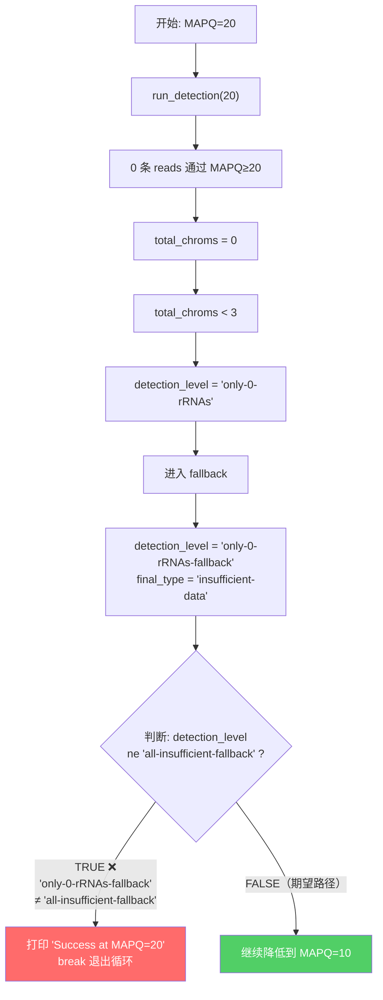

# Bug: Adaptive MAPQ 降阈值逻辑在 `only-0-rRNAs-fallback` 时提前终止

## 问题描述

在处理 `SRR7759714` 样本时，程序在 MAPQ=20 就停止了，没有继续降低阈值到 10 → 3 → 1。
尽管 SAM 文件中有 **252 对 concordant reads**，但它们的 MAPQ 值都 ≤ 7，全部被 MAPQ≥20 过滤掉了。

### 样本数据概况

```
=== SAM 文件过滤分析 ===
Total alignment lines (non-header): 504
After paired+first_in_pair filter:  252
After concordant (0x2) filter:      252   ← 全部通过

=== MAPQ 分布 (concordant, first-in-pair) ===
MAPQ=0:  192 reads
MAPQ=1:    9 reads
MAPQ=2:   26 reads
MAPQ=3:   22 reads
MAPQ=6:    1 reads
MAPQ=7:    2 reads
```

> [!IMPORTANT]
> 所有 reads 的 MAPQ 都 ≤ 7，因此 MAPQ≥20 过滤后 **零条 reads** 通过。如果程序继续降到 MAPQ≥1，将会有 60 条 reads 可用于分析。

---

## 根因分析

### 执行路径追踪



### Bug 位置

两个文件中有**相同的 bug**：

| 文件 | 行号 |
|------|------|
| [default_counting_withChrom.pl](file:///c:/Users/yudal/Documents/GitHub/resolveS/bin/default_counting_withChrom.pl#L390) | 第 390 行 |
| [auto_counting_withChrom.pl](file:///c:/Users/yudal/Documents/GitHub/resolveS/bin/auto_counting_withChrom.pl#L467) | 第 467 行 |

### 问题代码

```perl
# 当前逻辑：只在 'all-insufficient-fallback' 时重试
if ($result->{detection_level} ne 'all-insufficient-fallback') {
    debug_print "\n[ADAPTIVE] Success at MAPQ=$mapq\n";
    last;    # ← 在 'only-0-rRNAs-fallback' 时也会 break！
}
```

### 核心问题

`detection_level` 可能返回以下 fallback 值，但 **只有 `all-insufficient-fallback` 会触发降阈值**：

| detection_level | 含义 | 是否应该降阈值？ | 当前行为 |
|----------------|------|:-:|:-:|
| `only-0-rRNAs-fallback` | 零条 rRNA 序列 | ✅ 应该 | ❌ 当作成功 |
| `only-1-rRNAs-fallback` | 仅 1 条 rRNA | ✅ 应该 | ❌ 当作成功 |
| `only-2-rRNAs-fallback` | 仅 2 条 rRNA | ✅ 应该 | ❌ 当作成功 |
| `all-insufficient-fallback` | 有 8+ 条但全部 reads 不足 | ✅ 应该 | ✅ 正确处理 |
| `only-N-rRNAs-fallback` (N=3~7) | 有 rRNA 但级别不够 | ⚠️ 可选 | ❌ 当作成功 |
| `4of8-split-fallback` | 4:4 平分 | ❌ 不需要 | ✅ 正确 |
| `3of3`, `4of5` 等 | 成功检测 | ❌ 不需要 | ✅ 正确 |

---

## 修复方案

### 方案 A：基于 `final_type` 判断（推荐）

最简洁的方案 — 直接看最终结果是否为 `insufficient-data`：

```diff
 for my $mapq (@MAPQ_LEVELS) {
     $result = run_detection($mapq);
     $final_mapq = $mapq;

-    if ($result->{detection_level} ne 'all-insufficient-fallback') {
+    if ($result->{final_type} ne 'insufficient-data') {
         debug_print "\n[ADAPTIVE] Success at MAPQ=$mapq\n";
         last;
     }
-    debug_print "[ADAPTIVE] Got all-insufficient-fallback, trying lower MAPQ...\n";
+    debug_print "[ADAPTIVE] Got insufficient-data, trying lower MAPQ...\n";
 }
```

> [!TIP]
> **优点**: 逻辑最清晰 — "只要结果是 insufficient-data 就继续降阈值"。不需要枚举所有 detection_level 值。
> 
> **覆盖情况**: `only-0-rRNAs-fallback` → `insufficient-data` ✅；`all-insufficient-fallback` → `insufficient-data` ✅

### 方案 B：基于 `detection_level` 正则匹配

匹配所有应该重试的 detection_level：

```diff
-    if ($result->{detection_level} ne 'all-insufficient-fallback') {
+    if ($result->{detection_level} !~ /^(?:all-insufficient|only-\d+-rRNAs)-fallback$/) {
```

> [!NOTE]
> **优点**: 精确控制哪些 detection_level 触发重试，`only-3~7-rRNAs-fallback` 也会被覆盖。
>
> **缺点**: 正则表达式可读性稍差；如果未来新增 detection_level 值需要同步更新。

### 方案 C：基于 `detection_level` 取反 + 列表

```diff
-    if ($result->{detection_level} ne 'all-insufficient-fallback') {
+    # 以下 detection_level 值应该触发降阈值重试
+    my %should_retry = map { $_ => 1 } (
+        'all-insufficient-fallback',
+        (map { "only-${_}-rRNAs-fallback" } 0..7),
+    );
+    if (!$should_retry{$result->{detection_level}}) {
```

---

## 需要同步更新的位置

修复代码逻辑后，还需要更新以下注释/文档：

| 位置 | 内容 |
|------|------|
| `default_counting_withChrom.pl` 第 60 行 | 注释中对 ADAPTIVE MAPQ LOGIC 的描述 |
| `auto_counting_withChrom.pl` 对应位置 | 同样的注释 |

当前注释写的是：
```
# When detection_level is 'all-insufficient-fallback', try lower MAPQ:
```
需要更新为：
```
# When final_type is 'insufficient-data', try lower MAPQ:
```

---

## 验证方法

用 debug 目录中的 SAM 文件重新运行，确认程序会降到更低 MAPQ：

```bash
cd /c/Users/yudal/Documents/GitHub/resolveS
./bin/resolveS -a inputData/debug/resolveS.sam -d > stdout_fixed.log 2> stderr_fixed.log
```

**预期修复后 stderr 输出**：

```
[ADAPTIVE] Trying MAPQ_THRESHOLD = 20
[ADAPTIVE] Result: detection_level='only-0-rRNAs-fallback', strand_type='insufficient-data'
[ADAPTIVE] Got insufficient-data, trying lower MAPQ...

[ADAPTIVE] Trying MAPQ_THRESHOLD = 10
[ADAPTIVE] Result: detection_level='only-0-rRNAs-fallback', strand_type='insufficient-data'
[ADAPTIVE] Got insufficient-data, trying lower MAPQ...

[ADAPTIVE] Trying MAPQ_THRESHOLD = 3
...（此处应有 rRNA 数据）

[ADAPTIVE] Trying MAPQ_THRESHOLD = 1
...（60 条 reads 可用，应能得出结果）
```
